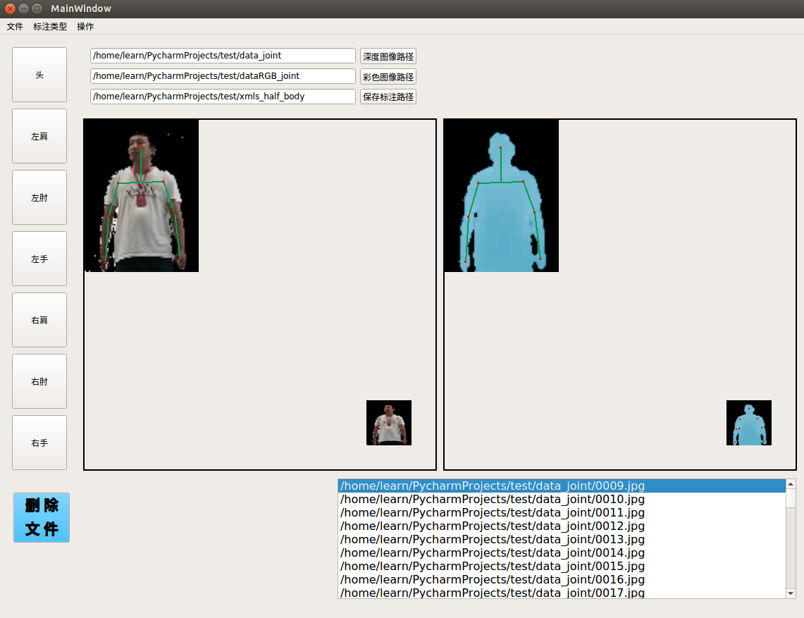

# label_joint
## 人体关节标注软件

### 图像标注

使用自主研发的pick_joint软件进行图像标注

```shell
cd label_joint
python3 pick_joint.py
```



**快捷键:**

w		鼠标改为待绘制头部/取消待绘制头部

q		鼠标改为待绘制左肩/取消待绘制左肩
a		鼠标改为待绘制左肘/取消待绘制左肘
z		鼠标改为待绘制左手/取消待绘制左手

e		鼠标改为待绘制右肩/取消待绘制右肩
d		鼠标改为待绘制右肘/取消待绘制右肘
c		鼠标改为待绘制右手/取消待绘制右手

1		上一张

3		下一张 